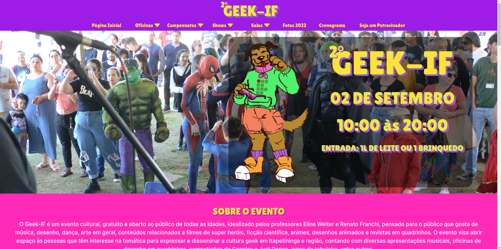

# GEEK IF

# Descrição do Projeto

O GEEK IF é um projeto que foi demandado um site para divulgar o evento conhecido como "GEEK IF" do câmpus de Itapetininga do Instituo Federal de São Paulo, construindo diversas páginas para o site como: Página Incial, Páginas das Atrações, Página de Galeria e diversas outras. Utilizando-se das tecnologias de AJAX e de uma API disponibilizada pelo Google Maps, o site é construído com HTML, CSS e JavaScript.

# Status do Projeto
Status: Finalizado

# Funcionalidades e Demonstração da Aplicação
O projeto apresenta diversos slides e a aplicação de uma mapa interativo para localização do câmpus, assim como, exibe diversas páginas de atrações, página de apoiadores, página do cronograma e uma galeria de fotos.

# Instruções de Uso
Para observar a página do GEEK IF, deve ser feito o clonamento deste repositório.
1. `git clone`
Após isso, rodar o código com o comando:
2. `go live`
da extensão "live server".

# Acesso ao Projeto (Link do Projeto)
[GEEK IF](https://geekif.com.br/)

# Contribuição/Autores
| [ Vitor Gabriel Cavalheiro](https://github.com/Vitor-G-Cavalheiro) | [ Gabriel Machado](https://github.com/gabs1m) |
| :---: | :---: |
